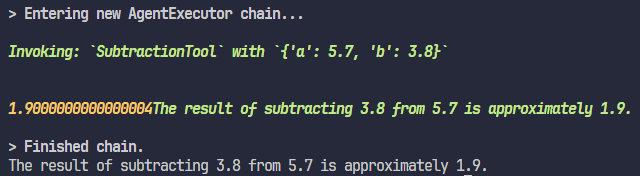

# 📗 Concepts

## 🔧 Tools

> Tools are interfaces that an agent, chain, or LLM can use to interact with the world.
>
> [<b>LangChain</b>](https://python.langchain.com/v0.1/docs/modules/tools/)

# 💻 How to Run

You will need to install the requirements first:

```bash
pip install -r requirements.txt
```

Now, set the API key:

```bash
export OPENAI_API_KEY="<api-key>"
```

Then you can run the project:

```bash
python calculator_agent.py --prompt '<prompt>'
```

# Examples

## ➕ Sum

```bash	
python calculator_agent.py --prompt 'What is 5.7 plus 3.8?'
```


## ➖ Subtract

```bash
python calculator_agent.py --prompt 'What is 5.7 minus 3.8?'
```



## ✖️ Multiply

```bash
python calculator_agent.py --prompt 'What is 5.7 times 3.8?'
```


## ➗ Divide

```bash
python calculator_agent.py --prompt 'What is 5.7 divided by 3.8?'
```

